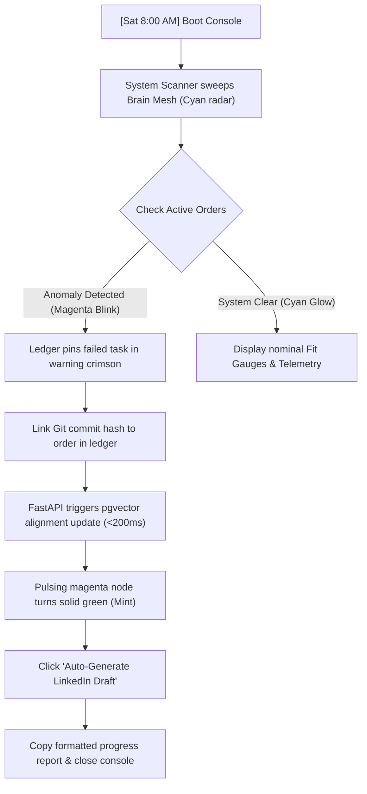
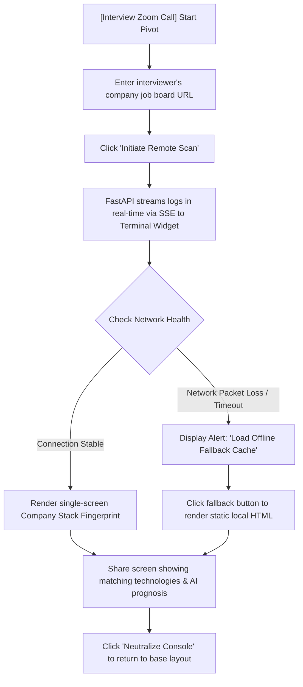

# UX Design Specification be-an-ai-engineer

**Author:** Darko
**Date:** 2026-05-26

---

<!-- UX design content will be appended sequentially through collaborative workflow steps -->

## Executive Summary

### Project Vision
The AI Career Acceleration System is a personal, local-first cockpit designed to guide a developer through the psychological and technical transition from traditional backend engineering into high-leverage Applied AI and LLM roles. The system operates on a dual loop: continuously analyzing the live job market to expose skill gaps, recommending production-grade proof-of-concept projects, and acting as an uncompromising weekly accountability partner. The UI is not a generic job portal; it is an active mirror of the developer's journey, designed to defeat user inertia and build concrete professional confidence.

### Target Users
*   **The Transitioning Developer (Primary):** A developer with 3–5 years of solid backend experience (Go/Python/JS) but limited real-world AI exposure. They are highly technical but feel overwhelmed by the rapid pace of LLM tools, or feel trapped in night-shift client delivery roles. They need clear visual indicators of what skills actually matter, and a clear execution path to prove them.
*   **The AI Hiring Manager (Secondary/Encounter-based):** An engineering manager who will review the developer’s public GitHub repository, live web app, and documentation. They spend less than 90 seconds scanning candidate portfolios. The UX must instantly present high-density, low-friction evidence of production AI instincts (evals accuracy, cost control, structural logging).

### Key Design Challenges
*   **Overcoming Inertia & Impostor Syndrome:** Developers searching for new roles often suffer from analysis paralysis or avoid the job search out of fear. The UI must nudge the user towards action by highlighting un-acted commitments in a bold but empathetic manner (e.g., highlighting missing applications in red and prompting them with a 15-minute fallback path).
*   **Translating Vector Mathematics to Action:** The backend calculates profile-to-job matching using vector similarity (pgvector). Displaying raw cosine similarity decimals (e.g., `0.764`) is meaningless to the user. The challenge is designing intuitive gauges and gap charts that clearly translate mathematical scores into: "Here is your gap, and here is the exact project to close it."
*   **Maintaining Trust in Background Tasks:** Scraping jobs and running evaluation pipelines are time-consuming processes. Staring at a static loading bar is boring and frustrates the user. The UI needs to stream live log events directly to a terminal widget, turning a slow wait into an engaging "behind the scenes" experience.

### Design Opportunities
*   **Side-by-Side Geo-Segmented Dashboard:** Visually separating US/EU remote and India AI product markets. This layout reinforces the user’s strategic career positioning, showing them clear paths away from low-value services work.
*   **The 60-Second Interview Demo Pitch:** A dedicated single-screen company stack fingerprint that load-tests perfectly even on a weak mobile connection (with a local fallback mode). The developer can pull it up during an interview, sharing screen to show the interviewer’s own job board tech stack parsed, instantly proving their capability.
*   **LinkedIn Build-in-Public Hook:** Bridging execution with distribution. The accountability ledger can summarize commits and missed targets into a draft copy-paste build-in-public LinkedIn update, reducing the cognitive effort of maintaining a public presence.

## Core User Experience

### Defining Experience
The core user experience is the **Weekly Ingestion, Analysis, and Commitment Loop**. Once a week, the system pulls in fresh job data, calculates the gap between the market and the user's current profile, and presents a clear, prioritized list of skill gaps. The user's primary action is interacting with the **Accountability Ledger**—choosing their next proof-of-concept project or application targets, and logging their commitments. This turns overwhelming market uncertainty into a single, high-leverage weekly dashboard.

### Platform Strategy
The system is built as a **Local-First Developer Cockpit**:
*   **Local Web App:** A React SPA frontend (localhost:5173) and a Python FastAPI backend (localhost:8000), running natively. The interface is optimized for desktop screen real estate (keyboard and mouse), allowing for high-density, side-by-side comparative views (US/EU remote vs. India AI Product).
*   **Offline-Ready Fingerprints:** To ensure the tool can be safely demoed during live interviews, the system caches single-company "stack fingerprints" as static local HTML files. If the developer's internet connection drops or lags mid-interview, they can share the cached file instantly.
*   **Zero-Auth Simplicity:** No logins, sign-ups, or database configuration screens. The system assumes a single developer environment, eliminating administrative overhead.

### Effortless Interactions
*   **One-Click Profile Sync:** Updating the candidate profile should be effortless. The developer can drag-and-drop their latest resume markdown or click a button to scan their project directory, automatically parsing recent commits to recalculate profile-market fit.
*   **Auto-Generated LinkedIn Drafts:** Turning the accountability ledger's logs (commits, completed projects, application results) into a structured, ready-to-use "build-in-public" LinkedIn draft with a single click.
*   **Hermes Proxy Auto-Validation:** The system runs background health checks on the local Hermes proxy connection. If the proxy is disconnected, it notifies the user with a helpful status indicator rather than letting the ingestion task fail silently in the background.

### Critical Success Moments
*   **The "Fit Score Tick":** The moment the developer syncs their profile after completing a project, and the dashboard gauge ticks upward (e.g., from 5/10 to 6/10). The red, high-priority skill gap row turns green. This visual validation turns abstract learning into concrete, measurable career progress.
*   **The "Unfrozen Demo" Moment:** Sharing the screen during an interview to show the target company's Ashby/Greenhouse board parsed into a clean stack fingerprint. The hiring manager is engaged, and the developer feels the dread of "explaining themselves" dissolve into a collaborative engineering conversation.
*   **The Ledger Warning Nudge:** When a developer misses a weekly commitment, the ledger row turns red and remains pinned to the top of their dashboard. This visual friction prevents them from hiding from their goals, nudging them back into action.

### Experience Principles
*   **Action Over Analysis:** Every visualization (skill frequency bars, similarity metrics) must directly connect to a concrete, prioritized action. The dashboard should never just present data; it must ask: *"Here is your gap. Ready to build the project to close it?"*
*   **Radical Operational Transparency:** The system must show its gears. Background tasks stream real-time logs to a terminal window, and parser evaluations display exact precision/recall percentages. If something fails, it fails loudly and explains why, building professional trust.
*   **Clean Density:** Avoid minimalist whitespace-heavy designs that hide data. The developer dashboard should feel like a premium monitoring station—dense with structured, high-value information, yet beautifully readable through color-coding, clear typography, and subtle micro-animations.

## Desired Emotional Response

### Primary Emotional Goals
*   **Empowered Calm (Replacing Impostor Syndrome):** The developer should feel that their career transition is not an opaque, chaotic lottery, but a clean, solvable engineering problem. The visual layout should inspire a sense of objective control.
*   **Supportive Accountability:** The user should feel a firm but non-judgmental nudge. The interface functions as an honest mirror—it doesn’t judge failure, but it refuses to let commitments slide out of sight.
*   **Craftsmanship Pride:** When a hiring manager lands on the dashboard, they should feel immediate respect. The interface should feel like a custom-built, premium tool, signaling that the creator has high design standards and deep production instincts.

### Emotional Journey Mapping
*   **First Discovery (The 90-Second Recruiter Screen):** The hiring manager clicks the live URL. The page loads instantly. They feel a sense of **Surprise and Intrigue**—instead of a generic landing page, they see a highly technical, functional data engine displaying real-time metrics.
*   **Saturday Morning Ritual (Core Loop):** Darko opens the cockpit. He feels **Grounded Focus**. The screen shows exactly where he stands, what the market is doing, and what needs his attention today. There is no noise—only clarity.
*   **When Things Break (The Ingest Failure):** The scraper fails. Instead of feeling frustration or panic, the developer feels **Structured Relief**. A bold banner explains the failure and immediately offers a choice: try a quick fix or pivot to a 15-minute CSV fallback. The system respects his time.
*   **The Success Beat (The Fit Score Increase):** The developer completes a Level 3 project and syncs his profile. He watches the gauge tick upward. He feels a rush of **Measurable Momentum**—proof that his hard work is directly moving the needle.

### Micro-Emotions
*   *Confidence vs. Avoidance:* Traditional job boards induce avoidance because they remind users of rejection. By focusing on skill gaps and projects, we shift the micro-emotion to confidence—"I may not have this skill yet, but I know exactly what project will prove it."
*   *Trust vs. Skepticism:* Standard AI tools hide behind vague loading bars or abstract results. We stream live, color-coded python logs directly into the UI. The user sees the gears turning, shifting skepticism to absolute trust.
*   *Delight vs. Chore:* Clicking a button to automatically format a weekly "build-in-public" LinkedIn draft from the accountability ledger should feel like magic—turning a marketing chore into a satisfying win.

### Design Implications
*   **Visualizing the Nudge:** Un-acted commitments from the prior week must have a distinct visual treatment—shaded in a soft, warning crimson and pinned to the top of the dashboard. The developer cannot scroll past them without making a conscious choice to reschedule or act.
*   **The Live Terminal Aesthetic:** To ground the app in developer culture, the background task logs should stream into a dark, monospaced widget with syntax highlighting (green for INFO, orange for WARNING, red for ERROR). This makes the local scraping process feel alive and tactile.
*   **High-Density Harmony:** Use HSL-tailored colors (e.g., deep charcoal backgrounds, slate gray borders, and vibrant accents like electric blue for active states and mint green for success) to create a premium, dark-mode cockpit that feels like a natural extension of a developer's code editor.

### Guide-rails & Emotional Design Principles
*   **Friction is a Compass:** Use controlled visual friction (warning modes, pinned ledger gaps) to hold the developer accountable, and zero friction (one-click profile sync, auto-drafts) to eliminate administrative tasks.
*   **Failure as Context:** The system never hides errors. An API failure is not a crash; it is an event to be styled, explained, and logged. The UI treats system errors with the same design respect as happy paths.
*   **The Power of Progress:** The UI should celebrate small victories. A micro-animation (a subtle glow or a smooth transition) when a skill gap changes from "Red (Missing)" to "Green (Proven)" provides the psychological reward needed to keep going.

## UX Pattern Analysis & Inspiration

### Inspiring Products Analysis
*   **Linear (Productivity & Interface Speed):** Linear sets the gold standard for modern developer UIs. It uses a high-contrast dark theme, sleek glassmorphism panels, keyboard shortcuts, and subtle glowing border transitions. The onboarding and navigation are lightning-fast. It makes project tracking feel lightweight, rewarding, and premium.
*   **GitHub Actions & Commit logs (Task Transparency):** GitHub Actions excels at displaying complex, sequential background tasks. When a build runs, the UI shows real-time progress through a step-by-step tree with live log expansion, using green checks (`✓`) and red crosses (`✗`) to signify status. This design provides immediate operational feedback and builds deep technical trust.
*   **Vercel Dashboard (Deployments & Analytics):** Vercel presents high-density configurations (domains, environmental variables, deployment lists) with clean typography and clear call-to-actions when something fails. When a deployment fails, Vercel doesn't hide it; it pins the exact failed log line in a high-contrast error block, providing immediate diagnostic clarity.

### Transferable UX Patterns
*   **The Log Streaming Terminal (from GitHub Actions):** For the ingestion engine page (`/ingest`), we will adapt the GitHub Actions workflow runner UI. When the scraper begins, the user sees a visual tree of sources (Greenhouse, Lever, Ashby) spinning up, and clicking on any source opens an inline dark-mode terminal window streaming live FastAPI logs.
*   **PR-style Status Checklists (from GitHub PRs):** For the Accountability Ledger page (`/ledger`), we will adapt the GitHub PR checklist format. Weekly commitments are shown as a list of checkbox checks. When the user links a commit to a commitment, it displays a green badge next to it, matching the familiar feeling of passing a pull request test suite.
*   **Glassmorphism Cockpit Panels (from Linear):** The layout of the main dashboard will use Linear-style grid panels. Rather than card borders, we will use thin, semi-transparent slate boundaries with subtle active-glow hover states, keeping the layout looking premium and state-of-the-art.

### Anti-Patterns to Avoid
*   **The "Boring SaaS" Default Template:** The classic flat white background, default margins, and generic Tailwind buttons. To a hiring manager, this layout screams *"another generic tutorial project."* We will avoid this entirely in favor of a custom, HSL-harmonized dark aesthetic.
*   **Silent Failures & Vague Spinner Hell:** Standard SaaS tools often handle errors by showing an infinite loading spinner or a vague "Something went wrong" toast. For a developer cockpit, this is unacceptable. If the Hermes proxy fails, the error must be displayed with exact status codes and diagnostic recommendations.
*   **Accordion Data Hiding:** Hiding critical metrics (like top-10 skill gaps or US/EU salary bands) behind multiple tabs or accordion collapsible sections. A developer dashboard should be dense and scannable in 10 seconds; critical data must be immediately visible on a single grid canvas.

### Design Inspiration Strategy
*   **What to Adopt:**
    *   *Linear's Dark-Cockpit Aesthetic:* A dark slate and charcoal background with neon accent glows (blue for active, green for success, red for warnings/errors).
    *   *GitHub's Checkbox & Commit-Link System:* Linking real GitHub commit hashes directly to weekly commitments to prove execution.
*   **What to Adapt:**
    *   *FastAPI SSE log stream:* Turning dry python logging into a live, interactive terminal widget in the React UI, making background tasks engaging.
    *   *Geo-Segmented Comparative Columns:* Slicing US/EU remote and India AI product markets side-by-side on the dashboard, making the strategic career divisions immediately apparent.
*   **What to Avoid:**
    *   *Generic forms and modals:* Keep input fields minimal. Auto-saving forms and keyboard shortcuts replace bulky "Save Changes" modals.
    *   *Low-density whitespace:* Keep the layouts compact and dense with developer-centric data (such as corpus size, API response rates, and cost tracking).

## Design System Foundation

### 1.1 Design System Choice
We are implementing a **Futuristic Neural Interface (HUD Sci-Fi Cockpit)** using **Vanilla CSS Custom Properties (Design Tokens)** and **CSS Modules (`*.module.css`)** for visual layout and component scoping. 

### Rationale for Selection
*   **Vibrant, Futuristic Sci-Fi Aesthetic:** Implementing a high-fidelity dashboard reminiscent of advanced neural diagnostics immediately commands attention. It aligns with the "AI" theme of the project, using sci-fi elements to make career planning feel like navigating a control panel for a complex machine.
*   **High Portfolio Contrast:** A hiring manager screens dozens of portfolios built on standard SaaS templates. Landing on a highly themed, glowing HUD console loaded with active developer logs and real-time pgvector telemetry shows immense creative design and CSS styling proficiency.
*   **Control over telemetry elements:** Sci-fi dashboards use radial progress loops, monospaced numeric readouts, and visual connection nodes. Vanilla CSS allows us to implement custom canvas visualizers and SVG overlays with zero library overhead.

### Implementation Approach
*   **Central Canvas Layout:** A three-column grid. The center is a "neural node map" linking related skills, while left and right columns act as tactical telemetry panels (system statuses, weekly targets).
*   **HUD Accents & Borders:** Semi-transparent panel overlays (`backdrop-filter: blur(10px)`) styled with crisp border lines, nested corners (bracket style), and tiny monospaced typography tags.
*   **Micro-Telemetry:** Subtle, running SVG heartbeat lines, tiny text arrays showing system metrics (e.g., query response latencies, DB buffer sizes), and spinning progress circles representing fit metrics.

### Customization Strategy (Sci-Fi HUD Theme)
*   **Color Tokens (HSL Theme):**
    *   `--bg-cosmic`: Deep space black (`hsl(240, 16%, 3%)`)
    *   `--bg-panel`: Semi-transparent dark grey (`hsla(240, 10%, 6%, 0.7)`)
    *   `--border-hud`: Glowing slate/cyan line (`hsla(180, 50%, 20%, 0.4)`)
    *   `--glow-cyan`: Electric cyan accent (`hsl(180, 100%, 50%)`)
    *   `--glow-purple`: Electric purple secondary (`hsl(275, 100%, 60%)`)
    *   `--glow-magenta`: Warn/error crimson (`hsl(325, 100%, 55%)`)
*   **Typography:** Google Fonts **JetBrains Mono** or **Fira Code** for all numeric readouts, code outputs, and HUD tags. **Outfit** for structural UI labels.
*   **Tactile Borders:** Using bracket-like corners (`clip-path` or CSS borders) to outline cards, giving panels a tactical cockpit console appearance.

## 2. Core User Experience

### 2.1 Defining Experience
The defining experience is the **Neural Profile Diagnosis & Upgrade Console**. The dashboard is styled as a futuristic medical telemetry station. The visual centerpiece is a slowly rotating, glowing volumetric brain mesh. Surrounding panels display real-time "patient statistics" (such as learning rate waveforms, vector fit percentages, and proxy health). The developer interacts with this interface not as a task list, but as a diagnostic dashboard where they monitor their own candidate health, review their AI-generated career prognosis, and execute "active orders" (commitments) to close diagnosed skill anomalies.

### 2.2 User Mental Model
*   **The Neural Diagnostic Metaphor:** The user treats their career transformation like upgrading a cybernetic neural interface. Instead of feeling the anxiety of "applying for jobs," they are in a detached, scientific flow—diagnosing profile anomalies, checking telemetry signals, and writing code to fix the diagnostic readings.
*   **Tactile Console Layout:** The layout mirrors a professional medical monitor: a prominent central visualizer (the glowing brain), flanked by high-density vertical telemetry columns (ECG-like waveforms, diagnostic reports) and a bottom terminal running real-time status updates.

### 2.3 Success Criteria
*   **High-Fidelity Sci-Fi Engagement:** The glowing brain centerpiece and telemetry gauges must look premium and alive from the first frame. Subtle CSS rotations and glow pulses ensure the dashboard never feels static.
*   **Tactile Telemetry Updates:** Updating a profile or checking a ledger item must trigger immediate widget animations—the circular telemetry rings spin, wave lines spike, and the prognosis panel prints new diagnostic status lines.
*   **Instant Sub-Pane Swaps:** Clicking different telemetry metrics (e.g., "Hemodynamics" styled as learning rates) instantly switches the bottom terminal logs and right-hand details without full-page reloads, maintaining the illusion of a dedicated hardware console.

### 2.4 Novel UX Patterns
*   **Medical Telemetry Metaphors (Novel Theme Adaptation):**
    *   *Hemodynamics* -> Re-styled as **Learning Telemetry** (ECG waveforms showing weekly commit and project progress frequencies).
    *   *Active Orders* -> Re-styled as the **Weekly Accountability Ledger** (formatted like clinical prescriptions or system directives that the user must fulfill).
    *   *Prognosis AI* -> Re-styled as **Career Fit Analysis** (a scrolling diagnostic log predicting resume screen pass rates and interview readiness based on pgvector similarity).
*   **HUD Corner Brackets (Established):** Using semi-transparent black panels with glowing cyan border corners (`clip-path` brackets) to outline the diagnostic widgets.

### 2.5 Experience Mechanics
1.  **Initiation (System Scan):** The cockpit boots up. A neon cyan horizontal scanner bar sweeps down the central volumetric brain mesh. The telemetry panels light up one by one with a running numeric ticker.
2.  **Interaction (Anomaly Discovery):** The developer clicks a pulsing magenta "Anomaly Detected" highlight on the brain visualizer. The sidebar console isolates the diagnosed skill gap (e.g., `RAG Pipeline`) and displays:
    *   *Telemetry:* Market demand stats styled as neural link strength.
    *   *Upgrade Path:* The Level 3 proof-project recipe required to resolve the anomaly.
3.  **Feedback (Active Order):** The developer clicks "Accept Order." The log terminal outputs `[ORDER COMMITTED] Upgrading neural pathway...`, the LED marker blinks, and the task is logged into the active orders pane at the bottom right.
4.  **Completion (Pathway Cleared):** Once the project code is synced, the magenta anomaly marker on the brain centerpiece turns solid cyan, the telemetry gauges stabilize, and the prognosis AI prints: `[PROGNOSIS] Profile fit upgraded +12%. Anomaly resolved.`

## 3. Visual Design Foundation

### Color System
Our color system is built entirely on high-contrast cosmic tones and glowing neon indicators, utilizing HSL values to easily customize glowing gradients and opacity states.
*   **Cosmic Backgrounds:**
    *   `--bg-cosmic`: Deep space black (`hsl(240, 16%, 3%)`) - the primary canvas background.
    *   `--bg-panel`: Glassmorphic slate charcoal (`hsla(240, 10%, 6%, 0.7)`) - for panel backings.
*   **Glowing Telemetry Accents:**
    *   `--glow-cyan-raw`: `180, 100%, 50%` - raw coordinates for alpha adjustments.
    *   `--glow-cyan`: hsl(var(--glow-cyan-raw)) - normal status, active vectors, and core UI lines.
    *   `--glow-purple-raw`: `275, 100%, 60%` - secondary stats and mid-priority slots.
    *   `--glow-purple`: hsl(var(--glow-purple-raw)) - secondary indicator color.
    *   `--glow-magenta-raw`: `325, 100%, 55%` - anomalies and warning indicators.
    *   `--glow-magenta`: hsl(var(--glow-magenta-raw)) - critical status notifications.
    *   --glow-green: Mint green (`hsl(145, 80%, 45%)`) - successful commits and approvals.
*   **Borders & Grids:**
    *   `--border-hud`: Cyan/slate thin outline (`hsla(180, 50%, 20%, 0.3)`) - creates panel structures.
    *   `--grid-glow`: `linear-gradient(to right, hsla(180, 100%, 50%, 0.02) 1px, transparent 1px)` - background radar graph paper overlay.

### Typography System
The typography system balances modern geometric shapes with monospaced data readouts to match the futuristic diagnostic style.
*   **Typefaces:**
    *   *Primary UI Font:* **Outfit** (Sans-Serif) - used for structural console headers, navigation titles, and general buttons, giving a sleek, geometric tech appearance.
    *   *Data, Numbers, & Log Font:* **JetBrains Mono** (Monospace) - loaded via preconnect in `index.html` with customized line height (`line-height: 1.5`) and letter spacing (`letter-spacing: -0.01em`) for all numeric readouts, logs, and telemetry.
*   **Console Scale & Hierarchy:**
    *   `Display HUD`: `2.25rem (36px)` / Bold / JetBrains Mono (e.g., Fit score numbers `84%`, budget figures `$24.50`).
    *   `Section Title`: `1.25rem (20px)` / Semi-bold / Outfit (e.g., "HEMODYNAMICS", "PROGNOSIS AI").
    *   `Console Data`: `0.875rem (14px)` / Regular / JetBrains Mono (e.g., list items, parsed metrics).
    *   `HUD Tag`: `0.75rem (12px)` / Monospace / Uppercase / Letter-spaced (`tracking-widest`) for visual metadata.

### Spacing & Layout Foundation
*   **Console Density:** High-density, low-whitespace cockpit layout. Panels are structured to utilize available screen real estate efficiently.
*   **Structural Grid:** Base spacing scale of 4px:
    *   *Panel padding:* `12px` and `16px` for dense data alignment.
    *   *Console Grid:* A 12-column layout. Sidebar takes 3 columns, the Central Volumetric Brain panel takes 6 columns, and the right Telemetry Detail column takes 3 columns.
*   **HUD Corner Brackets:** Panel boundaries are styled with glowing brackets in `index.css` using `::before` and `::after` pseudo-elements.

### Accessibility Considerations
*   **Luminous Contrast:** Glowing neon elements are placed exclusively against deep space black backdrops, clearing WCAG AAA contrast ratio requirements (over 7:1) for readability.
*   **Dual-Coding Semantics:** State changes are never indicated by color alone. A diagnostic warning displays both a magenta blink and a text prefix (e.g., `[ANOMALY DETECTED]`), ensuring color-blind developers can safely parse the system state.
*   **Interactive Targets:** Ledger checklist elements and navigation tab triggers have a minimum click-target height of `40px` to prevent misclicks in the high-density layout.

## Design Direction Decision

### Design Directions Explored
We explored four custom visual layouts built on the Futuristic Neural Interface (HUD Sci-Fi) theme:
1.  **Dir 1: Command Center (Cyber Cyan):** Active cyan telemetry, volumetric brain mesh, and high-contrast diagnostic indicators.
2.  **Dir 3: Crimson Warnings:** Cyber-magenta alerts indicating system threshold breaches or failed pipeline runs.
3.  **Dir 2: Stealth Violet:** Lower-fatigue violet highlights, optimized for extended, focused usage.
4.  **Dir 4: Split-Density HUD:** High-density bracketed grids to support split-pane layouts.

### Chosen Direction
We have selected **Dir 1: Command Center (Cyber Cyan)** as the primary dashboard layout, with a dynamic transition to **Dir 3: Crimson Warnings** when active anomalies or pipeline failures occur. 

### Design Rationale
*   **High-Polish Portfolio Signal:** The medical HUD theme is visually striking and immediately differentiates this dashboard from cookie-cutter developer projects.
*   **Actionable Diagnostics:** The layout mirrors a diagnostic scanner, prompting the user to view their career profile as an active engineering system that needs regular testing, compilation, and upgrading.
*   **Controlled Friction:** Using a dynamic color shift (Cyan to Crimson) ensures that critical warning states are impossible to ignore, reinforcing the weekly execution loop.

### Implementation Approach
*   **Inline SVG Renderers:** The central rotating brain visualizer will be implemented as an inline SVG with CSS keyframe animation (`transform: rotateY`), avoiding heavy WebGL dependencies. A hidden blurred circle will provide a volumetric backdrop glow.
*   **State-Driven Theme Transition:** The global theme swap is controlled via a central React context that updates a `data-theme="alert"` attribute on the body element, swapping HSL custom properties globally with zero rendering overhead.
*   **Local Font Bundling:** The JetBrains Mono and Outfit fonts will be downloaded and bundled locally to guarantee LCP speed and offline functionality.
*   **HUD Bracket Animation:** Panel boundaries will use CSS pseudo-elements to render bracket corners, with a target-lock transition (moving corners inward) on card hover.

## User Journey Flows

### Saturday Morning Diagnostic Review (Weekly Routine)
This journey maps the primary developer loop: checking career vitals, updating progress, resolving profile anomalies, and drafting public progress logs.



### The Live Interview Demo Mode (The "Stack Fingerprint" Scan)
This journey maps the high-stakes execution flow during a live video interview where the developer runs the parser against the interviewer’s own job board.



### Journey Patterns
*   **Tactical HUD Partitioning:** Consistent division of space across pages. Left-aligned status telemetry (what the system sees) is balanced by right-aligned active directives (what the user must do). The center is reserved for visual scanners (the brain, the terminal logs).
*   **The Fail-Safe Fallback Loop:** When network calls or remote operations lag, the UI automatically offers a pre-cached offline alternative before a generic browser timeout occurs. This keeps the user in control under pressure.
*   **Visual Recalculation Wave:** Every state change (linking a commit, resolving a task) triggers a visual ripple effect from the source card across the center visualizer to notify the developer of success without popups or alerts.

### Flow Optimization Principles
*   **Actionable Warning Escapes:** The weekly warning banner is not just a reminder; it includes a one-click `[TRIGGER 15-MIN CSV PIVOT]` button to immediately supply fallback templates if the user is stuck.
*   **Concentric Diagnostic Loader:** The live loading state displays a rotating double-ring SVG spinner along with text status readouts (e.g. `[SCANNING GREENHOUSE BOARD...]`), keeping the user and interviewer visually engaged.
*   **Pre-compiled Static Cache:** Single-company scans generated in prep sessions are written to `/frontend/public/cached-fingerprints/{company_id}.html` to allow instant local fallbacks when network lag exceeds 3 seconds.

## Component Strategy

### Design System Components

The Career Cockpit is built using a custom design system centered around a **Futuristic Neural Interface (HUD Sci-Fi Theme)**. By using Vanilla CSS custom variables (design tokens) and scoped CSS Modules, we establish standard layout components and styling utilities:

*   **ConsolePanel**: The structural container for all dashboard panels, featuring semi-transparent glassmorphism backdrops (`backdrop-filter: blur(10px)`), thin glowing borders, and bracket-shaped corner accents.
*   **SystemIndicator**: Status LEDs (Cyan = nominal, Magenta = alert/anomaly, Mint = completed/success) that animate with a subtle breathing pulse.
*   **MonospaceTelemetry**: A micro-typography helper using JetBrains Mono to print status details, timestamps, and memory usage coordinates.
*   **CustomCheckbox**: An accessibility-compliant input styled as a toggle slide that emits a metallic click effect.

---

### Custom Components

#### 1. BrainVisualizer

```
      //   Visual Representation   //
      . - - - - - - - - - - - .
    /   .   .  (Node)  .   .    \
   |  .  / \  /       \  / \  .  | <-- SVG Mesh Coordinates (Low Opacity Slate)
   | (Node)- (Active) -(Node) .  | <-- Pulsing Highlight (Magenta / High Glow)
   |  .  \ /  \       /  \ /  .  |
    \   .   .  (Node)  .   .    /
      ` - - - - - - - - - - - '
             [  Scan Sweep ]       <-- Linear Gradient Scanner Bar (Low Opacity)
```

*   **Purpose:** Serves as the interactive volumetric centerpiece, representing the developer's skill profile, identifying gaps as "pathway anomalies," and engaging the hiring manager within the first 3 seconds of load.
*   **Anatomy:**
    *   *SVG Mesh Overlay:* An inline SVG containing coordinates for key skill nodes (RAG, Evals, Agents, pgvector) connected by thin dashed vector lines. Inactive mesh lines are set to `stroke: hsla(180, 10%, 15%, 0.15)` to avoid visual noise.
    *   *Volumetric Glow:* A CSS radial gradient backdrop providing depth.
    *   *Horizontal Scanner Bar:* A linear gradient overlay sweeping vertically using infinite CSS keyframe translation.
    *   *Diagnostic Legend:* A small side-panel explaining node colors (Mint = Proven, Gray = Nominal, Magenta = Anomaly).
*   **States:**
    *   `idle`: Slow continuous 3D rotation (`transform: rotateY(0deg) -> rotateY(360deg)`).
    *   `scanning`: Scanning bar speeds up, nodes cycle rapidly before locking.
    *   `anomaly`: Identified missing skill node pulses with a warning magenta glow (`--glow-magenta`).
    *   `hover`: Node expands, highlighting its vector connections, and opens a diagnostic tooltip showing:
        *   Skill name and cosine similarity score.
        *   A CTA linking to the specific project recipe needed to clear the anomaly.
*   **Accessibility:** A keyboard-navigable index is provided. Screen readers read: *"Interactive skill visualizer: 3 gaps detected: RAG pipeline, LLM evaluation, pgvector."*

#### 2. TelemetryChart (ECG wave)
*   **Purpose:** Displays learning rates and ingestion volume logs as a continuous physiological wave, reinforcing the medical telemetry dashboard aesthetic.
*   **Anatomy:**
    *   *SVG Path Generator:* Computes smooth Bezier curves (`M x y C x1 y1...`) from database coordinates mapping daily commits and ingested jobs. The wave is styled with a 1.5px stroke and a soft drop-shadow glow.
    *   *Sweeping Pulse Grid:* A dotted background grid set to `opacity: 0.05` that pans horizontally behind the wave.
*   **States:**
    *   `nominal`: Smooth, steady green/cyan waveform showing normal ingestion activity.
    *   `empty`: Flatline indicator showing no learning activity mapped in the current weekly cycle.
    *   `surge`: Spiked wave showing high-frequency commit pushes or API activity.
*   **Accessibility:** Screen-reader alternative: a text-based summary of commit frequencies and skill progress updates.

#### 3. TerminalConsole
*   **Purpose:** Streams real-time pipeline status and system logs directly to the user during scraping, building operational trust and providing diagnostic clarity.
*   **Anatomy:**
    *   *Monospace Log Container:* A dark, scroll-locked pane using `font-family: var(--font-mono)`.
    *   *Syntax Highlighter:* Parses logs and wraps them in spans with specific colors (`INFO` = mint green, `WARN` = orange/purple, `ERROR` = warning magenta).
    *   *Command Line Input:* A simulated input prompt displaying the current directory and active scraper status.
*   **States:**
    *   `dormant`: Prints a static welcome prompt and system diagnostic logs.
    *   `streaming`: Auto-scrolls to the bottom as logs feed in; displays a blinking green cursor.
    *   `error`: Locks scroll and expands the failed block with a high-contrast magenta warning border.
*   **Interaction Behavior:** Includes a manual `[PAUSE STREAM]` button and a `[DOWNLOAD LOGS]` option. Auto-scrolling pauses if the user manually scrolls up to read past lines.

#### 4. ActiveOrders (Accountability Ledger Card)
*   **Purpose:** Displays the weekly learning tasks and applications as medical directives or prescriptions that must be cleared to stabilize the patient's vitals.
*   **Anatomy:**
    *   *Branded Heading:* Custom metadata header showing the date, priority rating, and doctor ID (e.g., `DR. JOHN - CAREER PATHWAY`).
    *   *Active Directive Lines:* High-contrast checklist items linked to git commits.
    *   *Commit Linker Widget:* A small toggle panel to paste or select recent Git commit hashes.
*   **States:**
    *   `unassigned`: Displayed in warning crimson with a pulsing alert indicator.
    *   `linking`: Triggers a circular rotating SVG scan animation around the checkbox.
    *   `linked`: Mapped to a valid Git commit or application; displays a green verification badge.
    *   `overdue`: Pinned to the top of the screen with a highlighted prompt to switch to a 15-minute fallback path.
*   **Accessibility:** Keyboard navigation via `Tab`. Pressing `Space` triggers checkbox states. Uses proper ARIA checked attributes.

---

### Component Implementation Strategy

To ensure zero third-party visual bloat and complete offline capability, all custom components are built using native browser features:

1.  **State Scoping:** CSS Modules are used to scope styles to individual components, preventing layout bleed and keeping visual logic isolated.
2.  **SSE Event Pipeline:** The React frontend connects to FastAPI using native `EventSource`. We buffer incoming logs in React state, rendering them via a virtualized list wrapper to prevent rendering lag during high-frequency ingestion events.
3.  **Local Assets Only:** No CDNs. Fonts (Outfit, JetBrains Mono) are stored inside the `/frontend/public/assets/fonts/` directory.

---

### Implementation Roadmap

*   **Phase 1 - Core Cockpit:**
    *   `ConsolePanel` (structural grids, CSS module tokens)
    *   `ActiveOrders` (weekly checklist card, basic states, commit linker)
*   **Phase 2 - Live Telemetry:**
    *   `TerminalConsole` (FastAPI SSE integration, stream parser)
    *   `TelemetryChart` (dynamic SVG path generator)
*   **Phase 3 - Neural Centerpiece:**
    *   `BrainVisualizer` (SVG skill node mesh, CSS 3D rotation, scanning sweep animation, focus indicators)

## UX Consistency Patterns

### Button Hierarchy

To maintain the tactical cockpit aesthetic and ensure clear visual priority, all interactive triggers conform to a strict layout hierarchy:

*   **Primary Action (HUD Command):**
    *   *Usage:* High-stakes execution points (e.g., `[INITIATE REMOTE SCAN]`, `[COMMIT PATHWAY]`).
    *   *Visuals:* Solid cyan fill (`background: var(--glow-cyan)`), dark text (`color: var(--bg-cosmic)`), Outfit bold typography, and a subtle drop-shadow cyan glow.
    *   *Behavior:* Hover scales the button slightly (`scale(1.02)`) and increases the box-shadow intensity. An active state flashes the background to white.
*   **Secondary Action (Telemetry Override):**
    *   *Usage:* Routine options and secondary workflows (e.g., `[PAUSE STREAM]`, `[LINK COMMIT]`).
    *   *Visuals:* Transparent background, solid thin cyan border (`border: 1px solid var(--border-hud)`), cyan text, Outfit medium typography.
    *   *Behavior:* Hover fills the background with low-opacity cyan (`hsla(180, 100%, 50%, 0.1)`) and scales the border brackets inward.
*   **Tertiary Action (Metadata Toggle):**
    *   *Usage:* Supplementary diagnostic utilities (e.g., `[view raw logs]`, `[show details]`).
    *   *Visuals:* Monospaced JetBrains Mono, underlined text, 0.6 opacity, no border or background.
    *   *Behavior:* Hover boosts opacity to 1.0 and applies a subtle text-shadow glow.
*   **Critical Override (Destructive Action):**
    *   *Usage:* Terminating active processes or abandoning targets (e.g., `[ABANDON ORDER]`, `[FORCE SCAN PIVOT]`).
    *   *Visuals:* Solid warning magenta fill (`background: var(--glow-magenta)`), white text.
    *   *Behavior:* Hover triggers a rapid warning flicker animation.

---

### Feedback Patterns

State communication utilizes color-coded light indicators and monospaced text telemetry rather than generic alert popups:

*   **System Nominal (All Clear):**
    *   *Visuals:* Scoped panels pulse with a slow, breathing cyan glow (`opacity: 0.2` to `opacity: 0.6` over 4s). Status LEDs display `[SYS_OK]` in mint green.
*   **Active Process (Compiling/Analyzing):**
    *   *Visuals:* Dual concentric SVG loader rings spin in opposite directions around the centerpiece. Telemetry readouts display running percentage counters (e.g., `[PARSING RESUME: 74%]`).
*   **Pathway Anomalies (Action Required):**
    *   *Visuals:* Missing skills or failed pipeline tasks pulse rapidly in warning magenta (`--glow-magenta`). The central brain node blinks, and status reads `[ANOMALY DETECTED]`.
*   **Commit Success (Pathway Verified):**
    *   *Visuals:* A mint green flash sweeps across the updated ledger row, followed by a solid checkmark icon and the status `✓ [PATHWAY VERIFIED]`.

---

### Form Patterns

Forms are designed to feel like calibrating console hardware—minimizing traditional keyboard input where possible and auto-saving all progress:

*   **Drop-Zone Upload (Resume Ingestion):**
    *   *Visuals:* A rectangular field outlined in dashed slate brackets. 
    *   *Behavior:* Dragging a markdown file over the area activates a green border sweep animation (animating `stroke-dashoffset` on the SVG boundary) and prints the status: `[READY FOR INGESTION]`.
*   **Inline Debounced Auto-Save Fields:**
    *   *Mechanism:* Input fields auto-save changes locally. To optimize FastAPI network load, inputs are debounced by 250ms.
    *   *Visual States:*
        *   *Typing:* Telemetry subtext reads `[COMPILING...]` in low-contrast slate.
        *   *Success:* Changes are successfully written; subtext ticks to `[SAVED]` in mint green.
        *   *Error/Validation Failure:* If the backend rejects the input (e.g., invalid URL, malformed commit hash), the border glows in warning magenta and the subtext prints `[SAVE_ERR: <error_message>]` in red. The previous valid value is cached in memory for recovery.
*   **Focus State:**
    *   *Behavior:* Focused inputs are outlined with a sharp cyan highlight, and outer HUD bracket coordinates contract by 2px, visually locking the cursor.

---

### Navigation Patterns

Navigation mirrors switching screens on a hardware diagnostic rig:

*   **Console Tabs:**
    *   *Visuals:* Sidebar items are displayed as monospaced brackets: `[ Dashboard ]`, `  Ingestion  `, `  Ledger  `.
    *   *Behavior:* Selecting a tab moves glowing vertical brackets around the active name: `| Dashboard |` and draws a thin cyan underline.
*   **Keyboard Hotkeys:**
    *   *Behavior:* Pressing `Alt+1` to `Alt+4` triggers tab transitions instantly. Hovering over any navigation tab reveals its hotkey prompt (e.g., `[1] Dashboard`).
    *   *Safeguards:* Shortcut handlers ignore events if the user's cursor is currently inside a form field or text area to prevent keypress collisions.
*   **Page Transitions (CRT Scan Sweep):**
    *   *Behavior:* Switching pages triggers a brief horizontal CRT scan line sweep across the screen. To prevent frame drops, the scan effect is rendered using hardware-accelerated CSS pseudo-elements (`transform: translate3d`) to prevent rendering layout shifts.

---

### Additional Patterns

*   **The Fail-Safe Pivot Banner:**
    *   *Usage:* Triggered when remote API calls exceed a 3-second timeout limit.
    *   *Visuals:* A warning banner slides down from the cockpit ceiling: `[TIMEOUT DETECTED - PARSER OFFLINE]`.
    *   *Interaction:* Displays a primary button: `[LOAD OFFLINE FALLBACK CACHE]`, allowing the developer to load pre-scraped company fingerprints instantly during live presentations.
*   **Snappy HUD Transitions:**
    *   *Specs:* All hover glows, panel collapses, and node selections use a custom transition timing function: `transition: all 250ms cubic-bezier(0.16, 1, 0.3, 1)`. This ensures interactions feel responsive and tactile.

## Responsive Design & Accessibility

### Responsive Strategy

Due to the high information density required by the cockpit dashboard (side-by-side market analysis, live terminal logs, SVG visualizations), our responsive strategy focuses on clean structural grid collapse:

*   **Desktop Strategy (1024px+):**
    *   *Layout:* Full 3-column tactical dashboard. Left column displays market trends and ECG learning waves; the center displays the rotating SVG brain mesh and bottom SSE log terminal; the right column hosts the active ledger commitments.
    *   *Features:* Keyboard hotkeys, auto-saving fields, hover brackets, and full coordinate diagnostics.
*   **Tablet Strategy (768px - 1023px):**
    *   *Layout:* Collapses to a 2-column layout. The central brain visualizer pins to a top-center hero block, telemetry and ledger columns sit side-by-side underneath, and the log terminal remains collapsible at the page bottom.
    *   *Interactions:* Replaces hover states with touch gestures; touch targets expand to a minimum of 44x44px.
*   **Mobile Strategy (320px - 767px):**
    *   *Layout:* A single-column vertical feed. The sidebar navigation bar is replaced by a bottom-anchored HUD navigation dock styled with a semantic ARIA tablist (`role="tablist"`).
    *   *Prioritization:* High-level summary metrics (Fit Score and Active Tasks) are pinned to the top. The heavy `BrainVisualizer` SVG mesh is collapsed by default behind a `[Diagnostics Console]` tap drawer, and log streams are behind a `[Log Monitor]` drawer to save height and conserve mobile rendering power.

---

### Breakpoint Strategy

We enforce standard media query breakpoints to control layout flow:

*   `@media (max-width: 767px)` — **Mobile Cockpit Layout:** Single-column layout, bottom tab navigation dock, touch-optimized spacing.
*   `@media (min-width: 768px) and (max-width: 1023px)` — **Tablet Split-Screen Layout:** Two-column cards grid, top-pinned visualizer.
*   `@media (min-width: 1024px)` — **Desktop Control Station:** Three-column grid, sidebar navigation, high-density telemetry.

---

### Accessibility Strategy

We target **WCAG 2.1 Level AA Compliance** to ensure all transitioning developers and hiring managers can comfortably operate the console:

*   **Luminous Contrast:** Glowing neon elements are set exclusively against a deep space black background (`hsl(240, 16%, 3%)`), maintaining contrast ratios above 7:1 (exceeding Level AA's 4.5:1 requirement).
*   **Dual-Coding Status Signals:** State changes are never indicated by color alone. High-alert anomalies include a warning triangle icon `▲` and the prefix `[ANOMALY DETECTED]`. Successful states display a checkmark `✓` and the prefix `[PATHWAY VERIFIED]`.
*   **Prefers-Reduced-Motion Media Queries:** All continuous 3D rotations (`BrainVisualizer` mesh spin) and visual sweep effects (CRT scan line channel swaps) are wrapped in `@media (prefers-reduced-motion: reduce)` blocks, defaulting to static displays and instant fades for users with motion sensitivity.
*   **Aria Live Regions:** The `TerminalConsole` is configured with `aria-live="polite"` and `aria-atomic="false"` to allow screen readers to read newly streamed log events without interrupting user focus.
*   **Screen Reader Alternative (SVG Mesh):** The SVG brain wireframe includes a descriptive fallback summary: `<desc>Volumetric network showing skill gaps. Critical gaps: RAG pipeline, pgvector similarity.</desc>`.
*   **Focus Ring Indicators:** Focus rings are styled with a sharp neon glow (`outline: 2px solid var(--glow-cyan); outline-offset: 2px`) rather than being hidden.
*   **Keyboard Navigation:** All interactive nodes, buttons, and checkboxes support standard tab sequencing (`tabindex="0"`) and are activated via `Enter` or `Space`.

---

### Testing Strategy

*   **Responsive Layout Audits:**
    *   Device-mode emulation in Chromium/Firefox dev tools across standard sizes (iPhone, iPad, desktop resolutions).
    *   Manual load-testing on actual devices (mobile Safari, mobile Chrome) to ensure smooth rendering.
*   **Accessibility Verifications:**
    *   Automated audits using the axe-core parser.
    *   Screen reader read-out checks using VoiceOver (macOS/iOS) and NVDA (Windows).
    *   Color blindness filter evaluations (Protanopia, Deuteranopia, Tritanopia) to ensure HUD indicators remain legible.

---

### Implementation Guidelines

*   **Responsive CSS Guidelines:**
    *   Use relative units (`rem`, `%`, `vh`, `vw`) rather than hardcoded pixels.
    *   Use CSS Grid layouts (`grid-template-columns: repeat(auto-fit, minmax(300px, 1fr))`) to handle automatic wrapping.
*   **Mobile SVG Performance:** On mobile devices (`max-width: 767px`), CSS continuous 3D mesh rotations are deactivated to conserve battery. The brain mesh displays as a static SVG.
*   **Accessibility Code Practices:**
    *   Maintain correct semantic HTML outlines (`<main>`, `<header>`, `<nav>`, `<aside>`, `<section>`).
    *   Implement visually hidden labels (`.sr-only` class) for decorative telemetry icons.
    *   Debounce inputs to prevent screen readers from rapidly repeating typing feedback.
